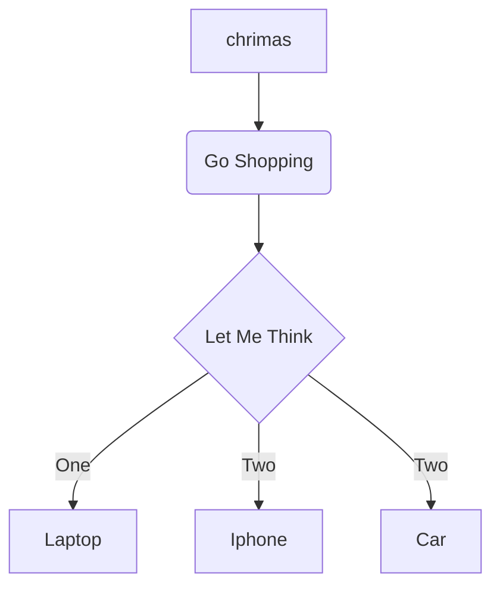

# 一级标题

### 代码高亮
```python
def findLinear(numbers):  # find a & b of linear sequence
    a = numbers[1] - numbers[0]
    a1 = numbers[2] - numbers[1]
    if a1 == a:
        b = numbers[0] - a
        return (a, b)
    else:
        print("Sequence is not linear")
```

### todo-list

- [ ] 项目1
  - [x] 子项目1
- [x] 项目2
- [ ] 项目3

### 流程图

